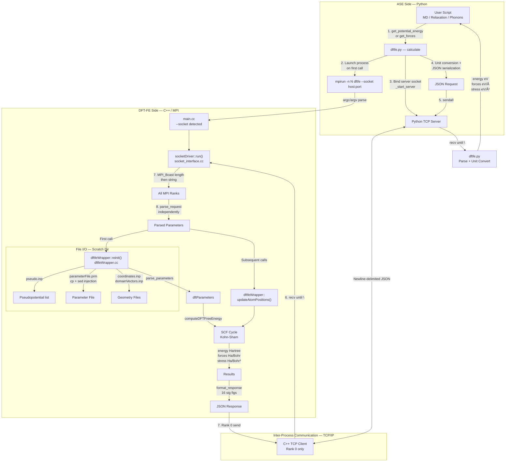

# ASE-DFTFE Interface: Developer Guide

**Contributor:** Mehul Darak  
**Scope:** ASE interface, socket backend, and DFT-FE integration  
**Status:** Under integration into DFT-FE (available to collaborators via "socket_interface_merge" branch, to be deployed as public release in the coming months)

---

> **Note for contributors:** This document is for developers working on or studying the ASE-DFTFE interface. It covers all code-level decisions, architecture, and changes made to the DFT-FE codebase to enable this interface.

## At a quick glance

This interface enables persistent, low-overhead coupling between ASE (Python) and DFT-FE (MPI/C++), enabling DFT-in-the-loop workflows such as MD, relaxation, and active learning, that are otherwise impractical due to MPI initialization overhead.

Core contributions:
- Implemented full ASE calculator (`interfaces/ase-dftfe/`)
- Added socket-based execution mode in `main.cc`
- Implemented `socket_interface.cc` for TCP + MPI coordination
- Extended `dftfeWrapper.cc` for reinitialization and position updates
- Achieved <1.6% communication overhead up to 16 nodes (8 GPUs/node)

# About the document

This document provides a detailed developer reference for the ASE-DFTFE socket interface. It maps the visual workflow to the underlying code, explains every design decision, and documents precisely what was added or modified across the DFT-FE codebase to make this work.

---

## Table of Contents

1. [What Was Built and Changed](#1-what-was-built-and-changed)
2. [Visual Workflow](#2-visual-workflow)
3. [Stage-by-Stage Code Breakdown](#3-stage-by-stage-code-breakdown)
4. [Key Design Decisions](#4-key-design-decisions)
5. [Parameter Reference](#5-parameter-reference)
6. [Examples and Capabilities](#6-examples-and-capabilities)
7. [Developer Notes and Gotchas](#7-developer-notes-and-gotchas)

---

## 1. What Was Built and Changed

The ASE-DFTFE interface required changes across two separate layers of the codebase: the **Python package** (new code, entirely written from scratch) and the **DFT-FE C++ core** (surgical additions to existing files).

### 1.1 New: `interfaces/ase-dftfe/` — The Python Package

This entire directory is new. It was not part of the original DFT-FE repository.

```
interfaces/ase-dftfe/
├── dftfe/
│   ├── __init__.py          ← The ASE Calculator (dftfeSocketCalculator / DFTFE)
│   └── utils/
│       ├── __init__.py
│       ├── cif_converter.py ← CIF ↔ DFT-FE format conversion utility
│       ├── prm_to_ase.py    ← NEW: .prm parser + directory-to-atoms utilities
│       ├── dataset_builder.py
│       ├── dataset_recorder.py
│       ├── extractor.py
│       ├── parser.py
│       └── writer.py
├── examples/                ← Worked examples: O₂, N₂, Cu phonons, graphene relax
├── dev_help/                ← This document, parameter_mapping.md, jupyterMatrix.md
├── user_help/               ← User-facing documentation
├── psp_library/             ← Bundled pseudopotential files
├── psp_spms/                ← SPMS pseudopotential files
├── pyproject.toml
└── setup.py
```

**`dftfe/__init__.py`** (`dftfeSocketCalculator`, aliased as `DFTFE`) implements:
- The full ASE `Calculator` interface (`calculate()`, `close()`, `__del__()`)
- Socket server lifecycle: `_start_server()`, `_launch_dftfe()`, `_get_free_port()`
- JSON serialization of all DFT-FE parameters
- Unit conversions on input (Å → Bohr) and output (Hartree/Bohr → eV/Å)
- A `debug_timing` flag to measure ASE overhead vs. actual DFT-FE compute time
- Multi-element pseudopotential support via a `psp_path` dict (serialized as `DICT|...` string)
- `keep_scratch` propagation to prevent scratch directory deletion (useful for debugging)

### 1.2 Modified: `src/main.cc`

**Original behavior:** `main()` always required a `.prm` parameter file as `argv[1]`.

**What was added (lines ~98–130):**
```cpp
// Mehul: Check for socket argument first
std::string socket_host = "";
int         socket_port = 0;
for (int i = 1; i < argc; ++i) {
    std::string arg = argv[i];
    if (arg == "--socket" && i + 1 < argc) {
        std::string val   = argv[i + 1];
        size_t      colon = val.find(':');
        if (colon != std::string::npos) {
            socket_host = val.substr(0, colon);
            socket_port = std::stoi(val.substr(colon + 1));
        }
    }
}
if (!socket_host.empty()) {
    dftfe::socketDriver driver(socket_host, socket_port, MPI_COMM_WORLD);
    driver.run();
    // ... clean MPI exit
    return 0;
}
```

**Effect:** When `dftfe --socket host:port` is passed, the standard file-based execution path is bypassed entirely. A `socketDriver` is instantiated and takes over. All standard solver modes (GS, MD, NEB, GEOOPT, etc.) are unreachable in socket mode — this is intentional. The include `#include "socket_interface.h"` was also added to `main.cc`.

### 1.3 New: `src/socket_interface.cc` (and `socket_interface.h`)

This file is entirely new. It implements the `socketDriver` class inside the `dftfe` namespace.

**Key responsibilities:**
- **`connect_socket()`** — Only Rank 0 opens a TCP client socket and connects to Python's server. Includes a 10-retry loop with 1-second sleep to handle startup latency.
- **`receive_data()`** — Rank 0 reads from the socket until `\n`; broadcasts length then raw string to all other MPI ranks via `MPI_Bcast`. Every rank parses the JSON independently.
- **`send_data()`** — Rank 0 sends the JSON response string back to Python.
- **`parse_request()`** — Pure-C++ JSON parser using `std::string::find` and `std::stringstream`. Handles arrays (`parse_matrix`, `parse_int_array`, `parse_bool_array`) and scalars/strings (`parse_scalar<T>`, `parse_string`). No third-party JSON library is used (intentional, to avoid adding a dependency to DFT-FE).
- **`format_response()`** — Serializes `energy` (double), `forces` (N×3), and `stress` (3×3 optionally) into a JSON string with 16 significant figures.
- **`run()`** — The main event loop: connect → wait for JSON → parse → first run calls `dft.reinit(...)`, subsequent runs call `dft.updateAtomPositions(...)` via displacement detection → call `dft.computeDFTFreeEnergy()` → send response.
- **`invert_3x3()`, `mat_mul()`** — Helper math utilities for potential future cell-deformation logic.

The `run()` loop also contains the full DFT-FE welcome banner (with the ASE interface attribution line added) gated behind `verbosity >= 1`.

**`parse_request()` signature** (all 30 parameters):
```cpp
void socketDriver::parse_request(
    const std::string &json,
    std::vector<std::vector<double>> &coords, std::vector<std::vector<double>> &cell,
    std::vector<dftfe::uInt> &numbers, std::vector<bool> &pbc,
    std::vector<dftfe::uInt> &mp_grid, std::vector<dftfe::uInt> &mp_grid_shift,
    dftfe::Int &spin_polarized, double &start_magnetization, double &fermi_temp,
    dftfe::uInt &npkpt, double &mesh_size, double &scf_mixing,
    std::string &mixing_scheme, dftfe::Int &polynomial_order,
    double &tolerance, std::string &xc, double &atom_ball_radius,
    dftfe::uInt &num_bands, std::string &orthogonalization_type,
    dftfe::uInt &wfc_block_size, dftfe::uInt &cheby_wfc_block_size,
    dftfe::Int &smeared_nuclear_charges, dftfe::Int &use_group_symmetry,
    dftfe::Int &use_time_reversal_symmetry, dftfe::Int &mixing_history,
    dftfe::Int &max_scf_iterations, dftfe::Int &dispersion_correction_type,
    dftfe::Int &pseudopotential_calculation, std::string &pseudopotential_filename,
    dftfe::Int &verbosity, bool &use_device,
    bool &keep_scratch, bool &compute_forces, bool &compute_stress,
    std::string &cmd);
```

### 1.4 Modified: `src/dftfeWrapper.cc`

**What was added:** A new overload of `dftfeWrapper::reinit()` that accepts explicit atomic data instead of a parameter file. This is the bridge between the socket interface and the DFT-FE physics engine.

**Location:** Lines ~324–1110 of `dftfeWrapper.cc`, marked with:
```cpp
// Mehul: Modified reinit to accept new parameters (ASE)
void dftfeWrapper::reinit(const MPI_Comm &mpi_comm_parent, const bool useDevice,
    const std::vector<std::vector<double>> atomicPositionsCart,
    ...
    const bool keepScratch, const bool computeIonForces, const bool computeStress)
```

**Key logic inside this new `reinit()`:**

1. **Scratch Folder Creation:** `createScratchFolder()` generates a unique directory named `dftfeScratch<rank>t<timestamp_ms>/`. The timestamp uses `std::chrono` for millisecond precision to avoid collision when multiple jobs start simultaneously.

2. **`pseudo.inp` Generation:** Reads all unique atomic numbers → looks up element symbols via `pseudoUtils::PeriodicTable` → resolves UPF file paths. Supports two modes:
   - **Single-element / directory mode:** Appends `/<Symbol>.upf` to the provided path.
   - **Multi-element dict mode:** Python sends `psp_path` as a `{symbol: path}` dict, which is serialized to `"DICT|sym1:path1|sym2:path2|..."` and parsed back in C++ using a `std::map<std::string, std::string>`.
   - Falls back to `$DFTFE_PSP_PATH` env var if no path is provided.

3. **`coordinates.inp` and `domainVectors.inp` Generation:** Writes fractional coordinates for periodic systems, Cartesian for non-periodic (with origin shift to center). All floats written with 16 decimal places.

4. **`parameterFile.prm` Injection:** Copies `$DFTFE_PATH/helpers/parameterFile.prm` to scratch, then uses `system("sed -i '...'")` to inject all parameter values. Each optional parameter is only injected if it differs from its sentinel value (e.g., `-1`, `999999`, `"Unprovided"`).

5. **`keepScratch` handling:**
   ```cpp
   d_dftfeParamsPtr->keepScratchFolder = keepScratch;
   ```
   If `keepScratch == true`, the `rm -rf dftfeScratch.../` call at the end of the DFT solve is skipped. This is essential for debugging: you can inspect the generated `parameterFile.prm`, `coordinates.inp`, etc.

6. **`computeIonForces` and `computeStress`:** These flags are injected into the `.prm` file via `sed`, overriding the defaults from the template. This allows the socket interface to toggle force/stress computation per-call without re-parsing the whole parameter system.

### 1.5 New: `utils/prm_to_ase.py` — DFT-FE Directory → ASE Setup

This file is entirely new. It provides a pure-Python bridge between existing DFT-FE benchmark directories (with `.prm`, `coordinates.inp`, `domainVectors.inp`, `pseudo.inp`) and a ready-to-run ASE setup — without requiring the user to hand-translate parameters.

**Three public functions, all exported via `dftfe.utils`:**

#### `parse_prm(prm_path: str) → dict`

A lightweight recursive parser for deal.II-style `.prm` files. It uses two regex patterns:
- `^\s*set\s+(.+?)\s*=\s*(.+)$` — matches parameter assignments
- `^\s*subsection\s+(.+)$` — matches subsection headers

Subsection nesting is tracked via a `section_stack` list. Keys are flattened with `.` separators so the entire file is represented as a single flat dict:
```python
prm["Brillouin zone k point sampling options."
    "Monkhorst-Pack (MP) grid generation.SAMPLING POINTS 1"]  # → 2
```
Values are auto-coerced: `"true"` / `"false"` → `bool`; numeric strings → `int` or `float`; everything else → `str`. Trailing `#` comments are stripped before coercion.

#### `_prm_to_calc_kwargs(prm, psp_dir) → dict` (internal)

Translates the flat prm dict into keyword arguments for `DFTFE(...)`. Key mappings:

| PRM key (dot-notation) | DFTFE kwarg |
|---|---|
| `Boundary conditions.PERIODIC1/2/3` | (used to infer PBC for `dftfe_to_atoms`, not passed to calculator) |
| `Brillouin zone … SAMPLING POINTS 1/2/3` | `mp_grid` |
| `Brillouin zone … SAMPLING SHIFT 1/2/3` | `mp_grid_shift` |
| `Brillouin zone … USE TIME REVERSAL SYMMETRY` | `use_time_reversal_symmetry` |
| `Finite element mesh … MESH SIZE AROUND ATOM` | `mesh_size` |
| `Finite element mesh … ATOM BALL RADIUS` | `atom_ball_radius` |
| `Finite element mesh … POLYNOMIAL ORDER` | `polynomial_order` |
| `SCF parameters.TOLERANCE` | `tolerance` |
| `SCF parameters.TEMPERATURE` | `fermi_temp` |
| `SCF parameters.MIXING METHOD` | `mixing_scheme` |
| `SCF parameters.MIXING PARAMETER` | `scf_mixing` |
| `SCF parameters.MAXIMUM ITERATIONS` | `max_scf_iterations` |
| `DFT functional parameters.EXCHANGE CORRELATION TYPE` | `xc` |
| `DFT functional parameters.PSEUDOPOTENTIAL CALCULATION` | `pseudopotential_calculation` |
| `DFT functional parameters.PSEUDOPOTENTIAL FILE NAMES LIST` | resolves `pseudo.inp` → `psp_path` dict |
| `USE GPU` | `use_device` |
| `VERBOSITY` | `verbosity` |
| `Geometry.Optimization.ION FORCE` | `compute_forces` |
| `Geometry.Optimization.CELL STRESS` | `compute_stress` |

`pseudo.inp` is parsed (lines of form `Z filename.upf`) and resolved to a per-element absolute-path dict, which is passed as `psp_path={"Li": "/abs/path/Li.upf", "O": "/abs/path/O.upf"}`.

#### `dftfe_dir_to_atoms(dftfe_dir, prm_file, ...) → (Atoms, dict)`

Orchestrates the full pipeline:
1. Locates `coordinates.inp` and `domainVectors.inp` in `dftfe_dir`.
2. Auto-detects the `.prm` file if `prm_file` is `None` (alphabetically first).
3. Calls `parse_prm()` → `_prm_to_calc_kwargs()` → `dftfe_to_atoms()` (from `cif_converter.py`).
4. Constructs `run_cmd = f"mpirun -np {np} {dftfe_binary}"`.
5. Instantiates `DFTFE(**calc_kwargs)` and attaches it to `atoms`.
6. Returns `(atoms, calc_kwargs)` — the calculator is **not yet launched** (lazy start on first `get_potential_energy()` call).

`extra_calc_kwargs` are merged last, so users can override any inferred parameter.

#### `generate_ase_script(dftfe_dir, prm_file, ...) → str`

Code-generates a standalone `.py` script by:
1. Running the same `parse_prm` + `_prm_to_calc_kwargs` pipeline.
2. Rendering each kwarg as a Python literal using a `_repr(v)` helper that handles `bool`, `str`, `tuple`, `dict`, and numeric types.
3. Writing a `textwrap.dedent`-formatted script that includes proper `sys.path` injection, `dftfe_to_atoms()` call, `DFTFE(...)` constructor, and results printing.
4. Respects `DFTFE_BIN` and `SLURM_NTASKS` environment variables at runtime so the generated script works unmodified in SLURM.

**Design note:** The `kw_block` lines are built with `    ` (4-space) indentation so they slot cleanly inside the `DFTFE(\n{kw_block}\n)` template.

---

## 2. Visual Workflow



---

## 3. Stage-by-Stage Code Breakdown

### Stage 1: Launch & Connection

**Python — `_launch_dftfe()`** in `dftfe/__init__.py`:
- Finds a free OS port via `_get_free_port()` (binds to port 0, reads assigned port, immediately closes).
- Constructs `cmd = f"{self.launch_cmd} --socket {self.host}:{self.port}"`.
- Spawns `subprocess.Popen(cmd, shell=True, stdout=log_file, stderr=STDOUT)`. DFT-FE stdout is redirected to `dftfe_output.log` to prevent pipe-buffer stalls when running MPI.
- Waits for the C++ process to call back with `server_socket.accept()`. A 120-second timeout here protects against hangs on slow HPC login nodes.
- Reads the `"READY\n"` handshake before returning.

**C++ — `main.cc`:**
- After `MPI_Init`, scans `argv` for `--socket host:port`. If found, constructs `socketDriver` and calls `driver.run()`, then exits cleanly. The standard `.prm`-file execution path is never reached.

**C++ — `socket_interface.cc::connect_socket()`:**
- Rank 0 only creates the socket and connects to Python's server.
- Includes a retry loop (up to 10 retries, 1s apart) because `mpirun` startup can lag behind Python's server.
- Sends `"READY\n"` handshake after connecting.
- All non-zero ranks skip this function entirely and block waiting for `MPI_Bcast` in `receive_data()`.

### Stage 2: Data Preparation & Send

**Python — `calculate()`:**

Unit conversion:
```python
positions_bohr = atoms.get_positions() / Bohr   # Å → Bohr
cell_bohr      = atoms.get_cell()      / Bohr   # Å → Bohr
```

The JSON payload contains both mandatory fields (coords, cell, numbers, pbc, cmd) and optional fields that are only added if non-`None`:
```python
optional_params = {
    "mp_grid": self.mp_grid, "xc": self.xc, "tolerance": self.tolerance,
    "wfc_block_size": self.wfc_block_size, "keep_scratch": self.keep_scratch,
    # ... ~20 more
}
for key, val in optional_params.items():
    if val is not None:
        data[key] = val
```

This keeps the JSON lean for simple use cases.

### Stage 3: Receive & Broadcast

**C++ — `receive_data()`:**
```cpp
// Rank 0: read until newline
int n = read(sockfd, buffer, 4095);
data += buffer;
if (data.find('\n') != std::string::npos) { done = true; }

// All ranks: synchronize
int len = data.length();
MPI_Bcast(&len, 1, MPI_INT, 0, comm);
if (rank != 0) data.resize(len);
MPI_Bcast((void *)data.data(), len, MPI_CHAR, 0, comm);
```
Every rank ends up with the full JSON string and parses it independently. This avoids a second broadcast of the parsed struct.

### Stage 4: Smart Reinit vs. Position Update

**C++ — `run()` event loop:**
```cpp
if (!initialized) {
    dft.reinit(comm, use_device, new_coords, numbers, new_cell, pbc, ...);
    initialized = true;
} else {
    // Compute displacement from current internal positions
    auto current_coords = dft.getAtomPositionsCart();
    // ... compute max_disp
    if (max_disp > 1e-6) {
        dft.updateAtomPositions(displacements);
    }
}
```

`reinit()` is expensive (full mesh generation). `updateAtomPositions()` is cheap (moves atoms on the existing mesh). The 1e-6 Bohr threshold guards against floating-point noise triggering an unnecessary update.

> **Current limitation:** Cell deformation (changing lattice vectors) is detected but not yet implemented in the socket loop. A cell change currently has no effect on the mesh — the interface assumes fixed-cell geometry optimizations (e.g., ionic relaxation only). Full variable-cell MD/relaxation would require re-calling `reinit()` when the cell changes.

### Stage 5: File I/O & Template Injection

**C++ — `dftfeWrapper::reinit()` (the new overload in `dftfeWrapper.cc`):**

The scratch directory is unique per rank + millisecond timestamp:
```cpp
// In createScratchFolder():
d_scratchFolderName = "dftfeScratch" + std::to_string(rank) + "t" + std::to_string(timestamp_ms);
```

The parameter file injection uses `sed -i` via `system()`:
```cpp
cmd = "sed -i 's/set NATOMS=.*/set NATOMS=" + std::to_string(n_atoms) + "/g' " + prm_path;
system(cmd.c_str());
// ... repeated for every parameter
```

All `sed` patterns use `.*` wildcard on the value side, so they work regardless of what the default template value is. String values with slashes (file paths) are escaped as `\\/` to avoid confusing `sed`'s delimiter.

The `ION FORCE` and `CELL STRESS` parameters receive special `sed` patterns using `[[:blank:]]\\+` to handle optional spaces in the key name:
```cpp
cmd = "sed -i 's/set[[:blank:]]\\+ION[[:blank:]]\\+FORCE.*/set ION FORCE=" + ionForce + "/g' " + prm;
```

### Stage 6: The Physics

**`dftfeWrapper::computeDFTFreeEnergy(bool computeForces, bool computeStress)`** triggers the full DFT-FE Kohn-Sham solve: FE mesh generation → density initialization → SCF cycle → forces/stress (conditionally). This is entirely existing DFT-FE code.

### Stage 7: Results & Return

**C++ — `format_response()`:**
```cpp
ss << std::scientific << std::setprecision(16);
ss << "{\"energy\": " << energy << ", \"forces\": [...], \"stress\": [...]}";
```
16 significant figures are used to preserve DFT-FE's full numerical precision across the socket boundary.

**Python — `calculate()`:**
```python
self.results['energy'] = result['energy'] * Hartree           # Ha → eV
forces_ha_bohr = np.array(result['forces'])
self.results['forces'] = forces_ha_bohr * (Hartree / Bohr)    # Ha/Bohr → eV/Å
stress_ha_bohr3 = np.array(result['stress'])
self.results['stress'] = stress_ha_bohr3 * (Hartree / Bohr**3) # Ha/Bohr³ → eV/ų
```

These are stored directly in ASE's `self.results` dict, making them accessible via `atoms.get_potential_energy()`, `atoms.get_forces()`, `atoms.get_stress()`.

---

## 4. Key Design Decisions

### 4.1 Python as Server, C++ as Client
ASE traditionally drives calculations (it's the "master"). Making Python the TCP *server* means mpirun can be fired with a `subprocess.Popen` and can connect back to Python when ready. The alternative (Python connecting to C++) would require DFT-FE to bind first — harder to coordinate startup timing.

### 4.2 No Third-Party JSON Library in C++
DFT-FE has a strict set of dependencies (deal.II, ELPA, p4est, etc.). Adding `nlohmann/json` or `rapidjson` would complicate the build system across all HPC clusters where DFT-FE is deployed. The custom parser (`parse_scalar<T>`, `parse_matrix`, etc.) handles all required types and is ~150 lines.

### 4.3 Sentinel Values for Optional Parameters
C++ has no concept of `None`. Optional parameters use out-of-range sentinels: `-1` for integers, `-1.0` for doubles, `999999` for unsigned ints, `"Unprovided"` for strings. In `dftfeWrapper::reinit()`, each parameter is only `sed`-injected if it differs from its sentinel, preserving the template file's default.

### 4.4 `psp_path` Dict Serialization
Multi-element systems need different UPF files per element (e.g., Li+O). Python dicts can't be cleanly sent in a flat JSON string without a proper JSON parser on the C++ side. The chosen encoding `"DICT|Li:/path/Li.upf|O:/path/O.upf"` is a simple, parser-friendly format that avoids nested JSON.

### 4.5 `keep_scratch` Flag
Without this, the scratch directory (`dftfeScratch0t.../`) is deleted after each SCF call. Setting `keep_scratch=True` propagates through JSON → `parse_request()` → `reinit(keepScratch=true)` → `d_dftfeParamsPtr->keepScratchFolder = true`. This prevents the `rm -rf` at line ~1105 of `dftfeWrapper.cc` from executing and lets the developer inspect the generated `parameterFile.prm` and input files.

### 4.6 `debug_timing` Flag
```python
if getattr(self, 'debug_timing', False):
    calc_start_time = time.time()
    # ...
    dftfe_start_time = time.time()
    self.conn.sendall(msg.encode())   # ← start measuring
    # ... receive response ...
    dftfe_end_time = time.time()
    # ...
    print(f"  Strict DFT-FE Wait Time: {dftfe_time:.4f} s")
    print(f"  ASE Pre/Post Overhead:   {ase_overhead:.4f} s")
```
This allows measuring how much time is spent in pure Python (unit conversion, JSON serialization, ASE bookkeeping) vs. actual DFT-FE computation. Results confirmed <0.01s overhead per call.

---

## 5. Parameter Reference

All parameters flow: `dftfe.py` constructor → JSON payload → `parse_request()` → `dftfeWrapper::reinit()` → `sed` into `parameterFile.prm`.

| ASE Parameter | JSON Key | `.prm` Injection | Default / Sentinel |
|---|---|---|---|
| `xc` | `xc` | `set EXCHANGE CORRELATION TYPE` | `"Unprovided"` |
| `polynomial_order` | `polynomial_order` | `set POLYNOMIAL ORDER` | `-1` |
| `tolerance` | `tolerance` | `set TOLERANCE` | `-1.0` |
| `fermi_temp` | `fermi_temp` | `set TEMPERATURE` | `-1.0` |
| `scf_mixing` | `scf_mixing` | `set MIXING PARAMETER` | `-1.0` |
| `mixing_scheme` | `mixing_scheme` | `set MIXING METHOD` | `"Unprovided"` |
| `mp_grid` | `mp_grid` | `set SAMPLING POINTS {1,2,3}` | `[]` (use template) |
| `mp_grid_shift` | `mp_grid_shift` | `set SAMPLING SHIFT {1,2,3}` | `[]` |
| `mesh_size` | `mesh_size` | `set MESH SIZE AROUND ATOM` | `-1.0` |
| `atom_ball_radius` | `atom_ball_radius` | `set ATOM BALL RADIUS` | `-1.0` |
| `num_bands` | `num_bands` | `set NUMBER OF KOHN-SHAM WAVEFUNCTIONS` | `999999` |
| `orthogonalization_type` | `orthogonalization_type` | `set ORTHOGONALIZATION TYPE` | `"Unprovided"` |
| `wfc_block_size` | `wfc_block_size` | `set WFC BLOCK SIZE` | `999999` |
| `cheby_wfc_block_size` | `cheby_wfc_block_size` | `set CHEBY WFC BLOCK SIZE` | `999999` |
| `spin_polarized` | `spin_polarized` | `set SPIN POLARIZATION` | `-1` |
| `start_magnetization` | `start_magnetization` | `set START MAGNETIZATION` + `set TOTAL MAGNETIZATION` | `-1.0` |
| `smeared_nuclear_charges` | `smeared_nuclear_charges` | `set SMEARED NUCLEAR CHARGES` | `-1` |
| `use_group_symmetry` | `use_group_symmetry` | `set USE GROUP SYMMETRY` | `-1` |
| `use_time_reversal_symmetry` | `use_time_reversal_symmetry` | `set USE TIME REVERSAL SYMMETRY` | `-1` |
| `mixing_history` | `mixing_history` | `set LBFGS HISTORY` | `-1` |
| `max_scf_iterations` | `max_scf_iterations` | `set MAXIMUM ITERATIONS` | `-1` |
| `dispersion_correction_type` | `dispersion_correction_type` | `set DISPERSION CORRECTION TYPE` | `-1` |
| `npkpt` | `npkpt` | `set NUMBER OF K-POINTS` | `999999` |
| `psp_path` (dict) | `pseudopotential_filename` | `pseudo.inp` (generated) | `"Unprovided"` |
| `compute_forces` | `compute_forces` | `set ION FORCE` | `True` |
| `compute_stress` | `compute_stress` | `set CELL STRESS` | `False` |
| `keep_scratch` | `keep_scratch` | `keepScratchFolder` flag | `False` |
| `verbosity` | `verbosity` | `set VERBOSITY` | `-1` |
| `use_device` | `use_device` | passed to `initialize()` | `False` |

---

## 6. Examples and Capabilities

All examples are in `interfaces/ase-dftfe/examples/`. Tested and confirmed working:

| Script | System | Capability Demonstrated |
|---|---|---|
| `o2_gs.py` | O₂ molecule | Ground state energy + forces, `debug_timing`, non-periodic |
| `n2_gs.py` | N₂ molecule | Ground state, non-periodic box |
| `graphene_gs.py` | Graphene | Periodic 2D, MP grid, complex build |
| `relax_graphene.py` | Graphene | **Ionic relaxation** via ASE FIRE optimizer, complex build |
| `relax_o2.py` | O₂ | Geometry optimization (bond length) |
| `bulk_fcc_al_gs.py` | Al FCC | Periodic 3D bulk, real build |
| `phonon_cu.py` | Cu FCC | **Phonon calculation** via Phonopy integration (3×3×3 supercell) |
| `Li2O_fcc_gs.py` ¹ | Li₂O FCC (95 atoms) | Periodic 3D bulk, MGGA-R2SCAN, 2×2×2 k-grid, `dftfe_to_atoms` ingestion |

¹ Located in `dftfe-benchmarks/accuracyBenchmarks/Li2O_fcc/dftfe/` (not in `examples/`).

The **Li₂O FCC example** is the first benchmark to use `dftfe_to_atoms()` to build the `Atoms` object directly from `coordinates.inp` + `domainVectors.inp` instead of constructing it by hand. It also demonstrates:
- The `psp_path` dict form with two ONCV UPF files (`Li_ONCV_PBE-1.2.upf`, `O_ONCV_PBE-1.2.upf`)
- `MGGA-R2SCAN` exchange-correlation (meta-GGA), requiring the **complex** DFT-FE binary
- `mixing_scheme="ANDERSON"` with `scf_mixing=0.7`
- `atom_ball_radius=6.0` (larger than GGA defaults due to ONCV pseudopotentials)

The Li₂O directory also ships `Li2O_ionRelax.prm` (GEOOPT mode with `FORCE TOL=5e-4`) as a future relaxation starting point. The ASE equivalent would be to swap `SOLVER MODE = GEOOPT` → an ASE `BFGS` or `FIRE` optimizer loop with `compute_forces=True`.

**`generate_ase_script` integration:** Running
```python
from dftfe.utils import generate_ase_script
generate_ase_script(
    "/path/to/Li2O_fcc/dftfe",
    prm_file="Li2O_scf.prm",
    dftfe_binary="/path/to/build_gpu/release/complex/dftfe",
)
```
auto-generates `Li2O_scf_ase.py` with all 14 parameters correctly populated, including the two-element `psp_path` dict resolved from `pseudo.inp`.

The phonon example is notable: by looping over ~50 displaced supercells with a single persistent `DFTFE` calculator instance, the DFT-FE MPI process is launched once and reused for all supercell calculations. The first call triggers a full `reinit()` (mesh generation); subsequent calls with different supercell geometries would ideally also reinit (since the number of atoms changes). The example works because each displaced supercell has the same atom count as the primitive (by using a fixed supercell matrix).

---

## 7. Developer Notes and Gotchas

### `verbosity` Check in `_start_server()`
There is a missing `None`-guard in `_start_server()`:
```python
if self.verbosity > 0:   # ← crashes if verbosity is None (default)
```
The fix is `if self.verbosity is not None and self.verbosity > 0`. This is a known issue when the user doesn't pass `verbosity`.

### `sed` and Path Escaping
File paths in `sed -i 's/pattern/replacement/'` need `/` → `\/`. The C++ code does this by constructing a `ForSed` variant of each path:
```cpp
const std::string dftfeCoordsFileNameForSed = d_scratchFolderName + "\\\\/coordinates.inp";
```
The four backslashes in C++ source code become two in the actual string, which become one escaped slash in the shell. Getting this wrong produces a silent no-op `sed` substitution.

### The Duplicate Key Bug in `calculate()`
In `dftfe/__init__.py::calculate()`, there is a duplicate key in the dict literal:
```python
data = {
    "coords": positions_bohr.tolist(),
    "cell": cell_bohr.tolist(),
    "numbers": atoms.get_atomic_numbers().tolist(),
    "pbc": atoms.get_pbc().tolist(),
    "coords": positions_bohr.tolist(),   # ← duplicate
    "cell": cell_bohr.tolist(),          # ← duplicate
    ...
}
```
Python silently overwrites with the second value (same value here, so no bug), but it should be cleaned up.

### MPI Rank 0 is "Wasted" During Computation
Rank 0 is the only rank that communicates with Python via the socket. During the DFT-FE SCF computation, Rank 0 participates fully in the MPI parallel solve — it is not a dedicated communication process. This is by design and is correct behavior. The concern was raised during scaling tests; timing logs confirmed Rank 0's compute time matches other ranks.

### `updateAtomPositions` Takes Displacements, Not Absolute Positions
```cpp
dft.updateAtomPositions(displacements);  // NOT new absolute positions
```
`displacements[i][j] = new_coords[i][j] - current_coords[i][j]`. If you call `getAtomPositionsCart()` after this, it should return the new absolute positions.

### Scratch Directory Accumulation
If `keep_scratch=True` is used in long MD runs, scratch directories will accumulate. Each call to `reinit()` creates a new directory. For long runs with fixed cells (only `updateAtomPositions` is called), only one scratch directory is created for the lifetime of the calculation.

### GPU Binding (`use_device` and `setDeviceToMPITaskBindingInternally`)
In the socket interface `reinit()` call:
```cpp
dft.reinit(comm, use_device, ..., use_device,  // setDeviceToMPITaskBindingInternally
           keep_scratch, compute_forces, compute_stress);
```
`use_device` is passed twice: once as the `useDevice` flag and once as `setDeviceToMPITaskBindingInternally`. This means GPU-to-MPI rank binding is always handled internally by DFT-FE when `use_device=True`. On Matrix cluster, this correctly assigns each MPI rank to its local GPU based on rank order.

### Running on Jupyter Notebooks (Matrix Cluster)
See `dev_help/jupyterMatrix.md` for the full salloc → SSH tunnel → notebook workflow. Key points:
- Start Jupyter on the **compute node**, not the login node.
- Use `--ip=0.0.0.0` so the notebook is accessible via tunnel.
- Multi-node runs work: only Rank 0 needs to reach the notebook's IP (it's always `localhost` on the lead compute node when using `srun`/`mpirun` from there).
