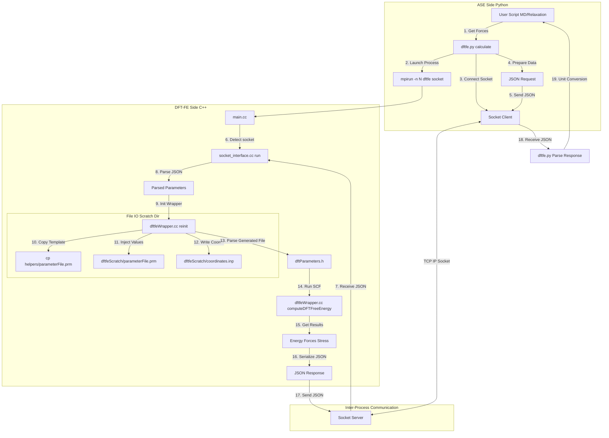

# Comprehensive Guide to the ASE-DFTFE Interface

This document maps the visual workflow of the ASE-DFTFE interface to the underlying code, logic, and file operations. Use the diagram below as your primary map, and refer to the numbered sections for code-level details.

## 1. Visual Workflow

---

## 2. Stage-by-Stage Breakdown

### Stage 1: Launch & Connection (Steps 1-3, 6)
**Goal**: Establish communication between Python and the MPI-distributed C++ executable.

*   **Python (`dftfe.py` - `_launch_dftfe`)**:
    *   Finds a free TCP port (`_get_free_port`).
    *   Executes `mpirun -n N dftfe --socket host:port`.
    *   **Lazy Launch**: The process is only started when `calculate()` is first called.
*   **C++ (`main.cc`)**:
    *   Parses command-line arguments. If `--socket` is found, it bypasses standard execution and instantiates `SocketDriver`.
*   **C++ (`socket_interface.cc` - `connect_socket`)**:
    *   Only **Rank 0** connects to the Python server. All other ranks wait for broadcasted instructions.

### Stage 2: Data Preparation & Send (Steps 4-5)
**Goal**: Serialize Python objects into a format C++ can understand.

*   **Logic (`dftfe.py` - `calculate`)**:
    *   **Unit Conversion**: Converts ASE units (Angstrom) to DFT-FE units (Bohr).
        *   `positions_bohr = atoms.get_positions() / 0.529177...`
    *   **Serialization**: Flattens numpy arrays (coords, cell) and collects all Calculator parameters (`mp_grid`, `xc`, etc.) into a single JSON object.
    *   **Transmission**: Sends the JSON string followed by a newline `\n`.

### Stage 3: Receive & Broadcast (Steps 7, 8)
**Goal**: Distribute instructions to all MPI ranks.

*   **Logic (`socket_interface.cc` - `run` & `receive_data`)**:
    *   **Rank 0** reads the JSON string from the socket.
    *   **MPI Broadcast**: Rank 0 broadcasts the *length* of the string, then the *string itself* to all other ranks.
    *   **Parsing**: Every rank parses the JSON independently to populate local variables (`coords`, `mp_grid`, etc.). This avoids moving large data structures later.

### Stage 4: DFT-FE Reuse (Step 9)
**Goal**: Avoid expensive initialization if possible.

*   **Logic (`dftfeWrapper.cc`)**:
    *   **First Run**: Calls `reinit()`. This triggers the full File I/O setup (Stage 5).
    *   **Subsequent Runs**: Checks if `atoms.get_positions()` has changed.
        *   If only positions changed: Calls `updateAtomPositions()` (Fast).
        *   If cell/grid changed: Calls `reinit()` (Slow, entails re-meshing).

### Stage 5: File I/O & Template Injection (Steps 10-12)
**Goal**: Bridge the dynamic request with DFT-FE's file-based core.

*   **Logic (`dftfeWrapper.cc` - `reinit`)**:
    1.  **Scratch Dir**: Creates `dftfeScratch<Rank>t<Time>/`.
    2.  **Template Copy**: Copies `DFTFE/helpers/parameterFile.prm` to scratch.
    3.  **Injection**: Executed via `system("sed -i ...")`.
        *   Example: `sed -i 's/set NATOMS=.*/set NATOMS=128/g' ...`
        *   *Note*: This relies on the template containing specific placeholder keys.
    4.  **Data Write**: Writes `coordinates.inp` and `domainVectors.inp` to scratch.

### Stage 6: The Physics (Steps 13-14)
**Goal**: Run the Self-Consistent Field (SCF) cycle.

*   **Logic (`dftfeWrapper.cc` - `computeDFTFreeEnergy`)**:
    *   Parses the *modified* `parameterFile.prm` (using standard DFT-FE parsers).
    *   Generates Finite Element mesh (adaptive or fixed).
    *   Solves Kohn-Sham equations.
    *   Computes forces and stress (if requested).

### Stage 7: Results & Return (Steps 15-19)
**Goal**: Return computed properties to Python.

*   **C++ Side**:
    *   Collects Energy (Hartree), Forces (Hartree/Bohr), and Stress.
    *   Formats them into a JSON response.
    *   Rank 0 sends JSON to Python.
*   **Python Side**:
    *   Parses JSON.
    *   **Unit Conversion**:
        *   Energy: `val * 27.211...` (eV)
        *   Forces: `val * 27.211... / 0.529...` (eV/Angstrom)
        *   Stress: `val * 27.211... / (0.529...)^3` (eV/Angstrom³)
    *   Updates `atoms.calc.results` dictionary.

---
